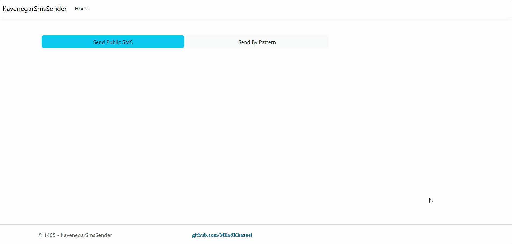

# Kavenegar Usage App


## Overview


Many developers frequently encounter challenges when configuring and deploying reliable SMS notification systems for end-users. This repository demonstrates a secure, enterprise-grade implementation of the `KavenegarAPI` within an ASP.NET Core environment. It facilitates both standard (public) messaging and pattern-based SMS (such as OTP verification) with a strict adherence to clean architecture and observability.

## Architectural & Security Highlights

- **Options Pattern:** Utilizes strongly typed configuration (`KavenegarSettings`) for secure credential management, ensuring separation of concerns from UI-layer ViewModels.
- **Cryptographic Security:** Replaces standard random number generators with `System.Security.Cryptography.RandomNumberGenerator` to produce mathematically unpredictable One-Time Passwords (OTPs), essential for protecting sensitive user data.
- **Observability:** Integrates `ILogger` for comprehensive audit trailing, preventing silent failures during critical communication workflows.

## Implementation Steps

1.  **Interface & Service Definition:** Established the `ISMSSender` interface and implemented the `SMSSender` service to encapsulate business logic.
2.  **Core Methods:** Defined `SendPublic` and `SendByPattern` methodologies to handle distinct messaging requirements securely.
3.  **Package Installation:** Ensure the Kavenegar SDK is installed via the Package Manager Console:
    ```powershell
    Install-Package KavenegarDotNetCore
    ```
4.  **Configuration Model:** Defined a `KavenegarSettings` class strictly for mapping infrastructure credentials.
5.  **Environment Setup:** Inject the required variables into your `appsettings.json` (ensure this file is excluded from public source control):
    ```json
    "KavenegarSettings": {
      "ApiKey": "YOUR_KAVENEGAR_API_KEY_HERE",
      "Sender": "YOUR_SENDER_LINE_HERE" // e.g., 2000660110
    }
    ```
6.  **Dependency Injection:** Configured the `Program.cs` pipeline to bind the settings via the `IOptions` pattern and injected the `ISMSSender` as a scoped service.
7.  **Controller Integration:** Utilized the `SendSmsController` to orchestrate requests and dispatch cryptographically secure tokens to end-users.
